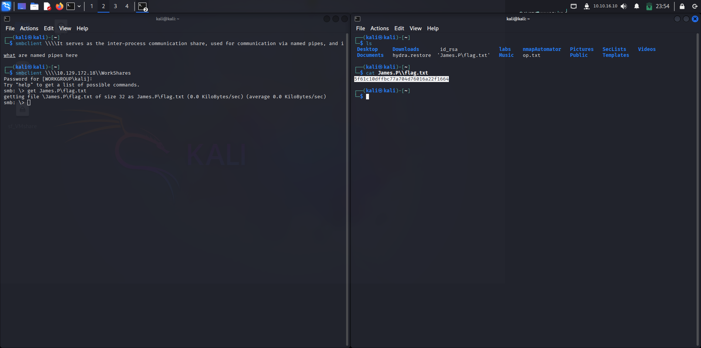

# Dancing — Hack The Box

**Difficulty:** Easy  
**Category:** SMB Exploitation  
**Date:** 2025-08-14

## Summary
Gained initial access through unauthenticated SMB share enumeration, extracted credentials from accessible files, and escalated privileges to Administrator.

## Steps
1. **Nmap scan** — open ports 139, 445
2. **SMB enumeration** — smbclient
3. **Credential discovery** — found plaintext creds in share
   
   
4. **Access** — logged in via SMB
5. **Privilege escalation** — reused creds for admin share

## Lessons Learned
- Null SMB sessions still occur in misconfigured networks.
- Always check for hidden shares.
